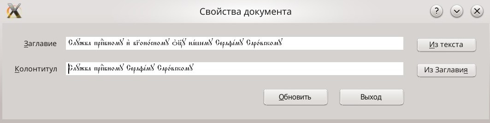

# cslRunningHeaderFromTitle

**MOVED TO:** [https://github.com/EliseyP/HymnographyCSL](https://github.com/EliseyP/HymnographyCSL)

`LibreOffice`-расширение для запуска `gui`-диалога, позволяющего оперировать текстом колонтитула для документа с шаблоном `Гимнография 20 новый` из проекта [csl_odt2tex](https://github.com/EliseyP/csl_odt2tex).

Для запуска диалога есть своя кнопка  на отдельной `toolbar`-панели, а также подменю в `Menu|Сервис|Addons`.

После запуска диалога в поле `Заглавие` автоматически помещается содержимое `user`-поля `TitleInText` (оно м.б. пустым, например, при создании документа).  
Также есть кнопка `Из текста`, для проведения этой операции **вручную**, при этом в поле помещается текст абзаца со стилем `Заглавие` (первый найденный).

У поля `Колонтитул` есть кнопка `Из Заглавия`, которая позволяет скопировать текст заглавия в поле колонтитула. Текст может редактироваться.

По нажатии кнопки `Обновить`, содержимое полей `Заглавие` и `Колонтитул` заносятся в `user`-поля `TitleInText` и `RunningHeader` соответственно. Содержимое поля `RunningHeader` при этом автоматически помещается в колонтитулы документа.

В данном примере укорочен текст Заглавия, слишком длинный для колонтитула.

